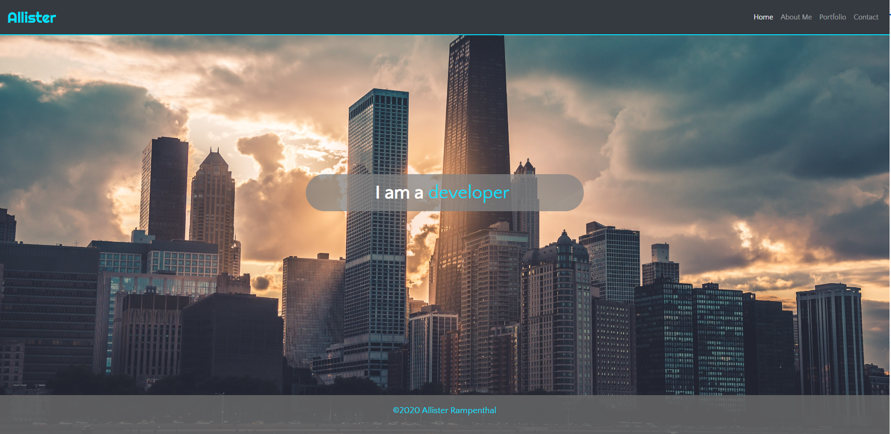

# Personal Portfolio
Address for webpage: https://daysloth.github.io/Personalportfolio/index.html

## Description 

This project is a start to my public portfolio for employers to view. This website was built using BootStrap as part of the Vanderbilt bootcamp course. I also included a stylesheet using my own CSS to override some of the colors/fonts used with bootstrap. I feel like these improved the look of the site right now. As my knowledge increases over the coming weeks I will be adding more projects and updating the usability of the site.  

## Credits

Website is built with Bootstrap

Images used for contact page came from: https://flaticon.com/

## License

Copyright (c) Allister Rampenthal. All rights reserved.

Licensed under the [MIT](https://choosealicense.com/licenses/mit/) license
